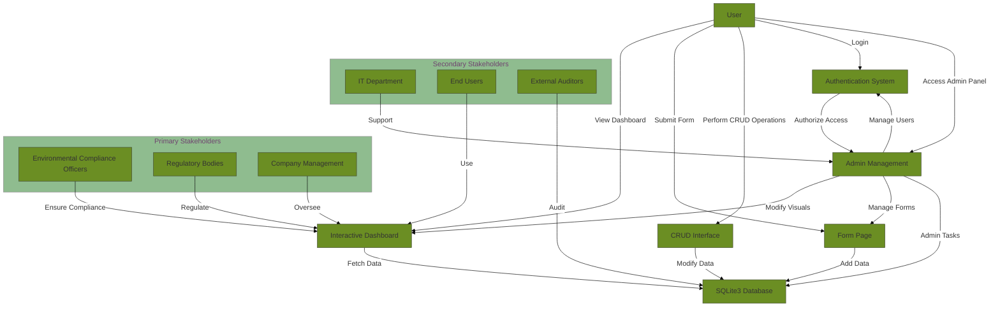
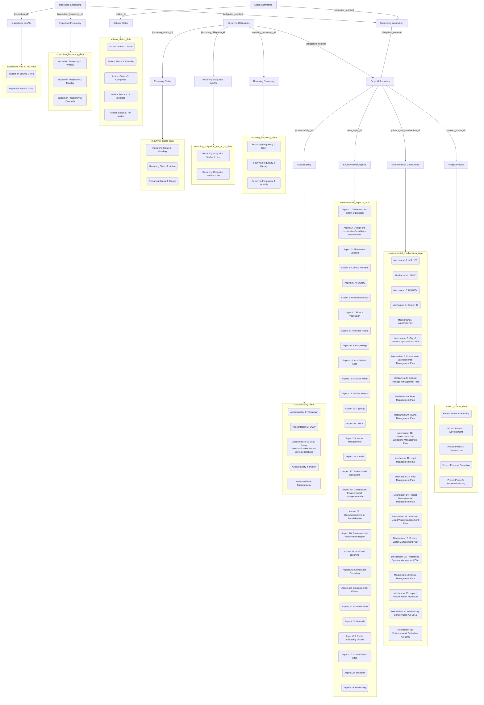

# Business Analysis Document

## Project Name: Environmental Compliance Management System

### Author: Kinley Zangmo
### Date: 07-08-2024

---

## 1. Executive Summary

The Environmental Compliance Management System (ECMS) aims to address the need for efficient and effective environmental compliance management. This system will streamline processes, ensure regulatory compliance, and improve data accuracy through the development of a Progressive Web Application (PWA). The PWA will feature real-time monitoring and alerts, geospatial data visualization, comprehensive reporting, and a user-friendly interface. The key benefits include improved compliance tracking, enhanced data accuracy, streamlined processes, better decision-making through data insights, and increased operational efficiency.

---

## 2. Project Objectives

Develop a scalable and secure PWA.

Implement real-time monitoring and alerting.

Provide comprehensive reporting and dashboard functionality.

Integrate geospatial analysis tools.

---

## 3. Stakeholder Analysis

### Stakeholder Identification
### Key Stakeholders
The key stakeholders for the Environmental Compliance Management System (ECMS) project include Environmental Compliance Officers, Regulatory Bodies, Company Management, the IT Department, End Users, and External Auditors.

### Stakeholder Needs

**Environmental Compliance Officers** need real-time monitoring and alerts, detailed reports, and geospatial analysis tools to ensure they can track compliance efficiently. They expect accurate, up-to-date data, a user-friendly interface, and robust security for sensitive information.

**Regulatory Bodies** require access to comprehensive reports to verify compliance with standards. They expect timely data submission, transparency in compliance processes, and secure access to information.

**Company Management** needs high-level dashboards for quick insights, detailed reports for decision-making, and assurance of regulatory compliance. They expect improved operational efficiency, data-driven insights for strategic planning, and a secure, reliable system.

**The IT Department** requires clear system documentation, monitoring tools, and integration capabilities with existing infrastructure. They expect scalability, reliability, minimal disruption during deployment, and support for ongoing maintenance.

**End Users** need an intuitive interface, quick access to compliance information, and reliable performance. They expect a user-friendly design, responsive support, and continuous system improvements based on feedback.

**External Auditors** need access to accurate compliance data, tools for thorough audits, and assurance of data integrity and security. They expect transparent and accessible information, timely responses to inquiries, and support during the audit process.

---

## 4. Requirements Analysis

### Functional Requirements
**Real-Time Monitoring and Alerts**: The system should provide real-time monitoring of compliance data and alert stakeholders of any deviations.

**Geospatial Data Visualization**: Integration of geospatial analysis tools to visualize environmental data on maps.

**Reporting and Dashboard Functionality**: Generate comprehensive reports and provide interactive dashboards for data analysis.

**User Management**: Allow administrators to manage user roles and permissions.

**Data Import and Export**: Facilitate data import from various sources and export to different formats.

### Non-Functional Requirements
**Security**: Ensure data encryption, secure authentication, and compliance with data protection regulations.

**Scalability**: The system should be scalable to handle increasing amounts of data and users.

**Performance**: Ensure the system performs efficiently under load, with minimal latency.

**Reliability**: The system should be reliable with minimal downtime.

**Usability**: The user interface should be intuitive and user-friendly, providing a seamless user experience.

**Compatibility**: Ensure compatibility with various browsers and devices.

---

## 5. Use Case Analysis

### Use Case Diagram
Include a use case diagram to illustrate the interactions between users and the system.

### Use Case Descriptions

### 1. View Dashboard
**Description:** Users can view the interactive reporting dashboard, which displays data through various diagrams and charts.

**Actors:** End Users, Environmental Compliance Officers, Regulatory Bodies, Company Management

**Preconditions:** User must be logged in.

**Postconditions:** User can see visual representations of data and interact with the dashboard to drill down into detailed data.

### 2. Submit Form
**Description:** Users can submit forms to add new data to the SQLite3 database.

**Actors:** End Users, Environmental Compliance Officers

**Preconditions:** User must be logged in and have the necessary permissions.

**Postconditions:** New data is added to the database, and the dashboard is updated accordingly.

### 3. Perform CRUD Operations
**Description:** Users can create, read, update, and delete database rows through the interface.

**Actors:** End Users, Environmental Compliance Officers, IT Department

**Preconditions:** User must be logged in and have the necessary permissions.

**Postconditions:** Database records are created, read, updated, or deleted as per the user's actions.

### 4. Login
**Description:** Users can log in to the system using their credentials.

**Actors:** End Users, Environmental Compliance Officers, Regulatory Bodies, Company Management, IT Department, External Auditors

**Preconditions:** User must have valid login credentials.

**Postconditions:** User is authenticated and granted access to the system based on their role.

### 5. Access Admin Panel
**Description:** Admin users can access the admin panel to manage users, roles, and application settings.

**Actors:** Company Management, IT Department

**Preconditions:** User must be logged in and have admin privileges.

**Postconditions:** Admin can manage users, roles, and settings, and perform higher-level tasks.

### 6. Fetch Data
**Description:** The dashboard fetches data from the SQLite3 database to display in charts and diagrams.

**Actors:** Interactive Dashboard

**Preconditions:** Data must be available in the database.

**Postconditions:** Data is fetched and displayed on the dashboard.

### 7. Add Data
**Description:** The form page adds new data to the SQLite3 database upon form submission.

**Actors:** Form Page

**Preconditions:** Form must be correctly filled out and submitted.

**Postconditions:** New data is added to the database.

### 8. Modify Data
**Description:** Users can modify existing data in the SQLite3 database through the CRUD interface.

**Actors:** CRUD Interface

**Preconditions:** User must have the necessary permissions to modify data.

**Postconditions:** Existing data is updated in the database.

### 9. Authorize Access
**Description:** The authentication system authorizes user access to various parts of the application based on their role.

**Actors:** Authentication System

**Preconditions:** User must be logged in.

**Postconditions:** User is granted or denied access to specific features based on their role.

### 10. Manage Users
**Description:** Admin users can manage user accounts, including creating, updating, and deleting users.

**Actors:** Admin Management

**Preconditions:** Admin must be logged in and have the necessary permissions.

**Postconditions:** User accounts are managed as per admin actions.

### 11. Modify Visuals
**Description:** Admin users can modify the visuals on the dashboard without writing code.

**Actors:** Admin Management

**Preconditions:** Admin must be logged in and have the necessary permissions.

**Postconditions:** Dashboard visuals are updated as per admin actions.

### 12. Manage Forms
**Description:** Admin users can manage the form page, including adding, updating, and deleting forms.

**Actors:** Admin Management

**Preconditions:** Admin must be logged in and have the necessary permissions.

**Postconditions:** Form pages are managed as per admin actions.

### 13. Admin Tasks
**Description:** Admin users can perform higher-level tasks such as user access control and database schema modifications.

**Actors:** Admin Management

**Preconditions:** Admin must be logged in and have the necessary permissions.

**Postconditions:** Higher-level admin tasks are completed as per admin actions.

### 14. Ensure Compliance
**Description:** Environmental Compliance Officers ensure that the data and reports comply with environmental regulations.

**Actors:** Environmental Compliance Officers

**Preconditions:** Officers must have access to the dashboard and data.

**Postconditions:** Compliance is ensured through data analysis and reporting.

### 15. Regulate
**Description:** Regulatory Bodies oversee and regulate the data and reports to ensure they meet legal standards.

**Actors:** Regulatory Bodies

**Preconditions:** Regulatory Bodies must have access to the dashboard and data.

**Postconditions:** Data and reports are regulated to meet legal standards.

### 16. Oversee
**Description:** Company Management oversees the overall functionality and usage of the dashboard.

**Actors:** Company Management

**Preconditions:** Management must have access to the dashboard and admin panel.

**Postconditions:** The dashboard is used effectively for company operations.

### 17. Support
**Description:** The IT Department provides technical support for the dashboard and its components.

**Actors:** IT Department

**Preconditions:** IT Department must have access to the admin panel and system components.

**Postconditions:** Technical issues are resolved, and the system runs smoothly.

### 18. Use
**Description:** End Users interact with the dashboard to view and analyze data.

**Actors:** End Users

**Preconditions:** Users must be logged in and have the necessary permissions.

**Postconditions:** Users can view and analyze data through the dashboard.

### 19. Audit
**Description:** External Auditors audit the data and reports to ensure accuracy and compliance.

**Actors:** External Auditors

**Preconditions:** Auditors must have access to the dashboard and data.

**Postconditions:** Data and reports are audited for accuracy and compliance.

---

## 6. Business Process Modeling

### Process Flow Diagrams
Include process flow diagrams to visualize the business processes.

### Process Descriptions
Provide detailed descriptions of each business process.
These descriptions provide a comprehensive overview of each step involved in the form data entry and management process.

### 1. **Form Access and User Interaction**
- **Form Access**: Users log into the web portal through a secure HTTPS connection. The `django.contrib.auth` module handles authentication, ensuring that only authorized users can access and submit forms.
- **Dashboard Navigation**: After logging in, users are redirected to a dashboard where they select the appropriate form based on their task, such as project phase tracking or compliance reporting.
- **Form Layout and Input**: The form is built using HTML5 and CSS3, ensuring accessibility on various devices. JavaScript and jQuery handle dynamic content, enhancing the user experience. Fields are grouped into logical sections, such as Project Information, Environmental Aspects, and Inspection Scheduling.

### 2. **Project Information Input**
- **Project Name**: Entered by the user and stored in the `Project Information` table. This field is required and must be unique.
- **Accountability**: Selected from a dropdown, with options dynamically populated from the `Accountability` table. This links directly to the project in the database.
- **Project Phase**: Selected from another dropdown, influencing which sections of the form are displayed.

### 3. **Environmental Aspects**
- **Aspect Selection**: Chosen from a multi-select dropdown linked to the `Environmental Aspects` table. Users can select multiple aspects that apply to their project.
- **Compliance Mechanisms**: Selected from a dropdown, with additional fields appearing based on the selection. Compliance information is stored in the `Environmental Mechanisms` table.

### 4. **Recurring Obligations**
- **Obligation Status**: Users indicate whether there are recurring obligations, triggering further input fields if selected.
- **Frequency and Status**: Selected from predefined options in the `Recurring Frequency` and `Recurring Status` tables, respectively.

### 5. **Inspection Scheduling**
- **Inspection Requirement**: A yes/no selection that determines if inspection scheduling fields are shown. If yes, the frequency and details are recorded in the `Inspection Scheduling` table.

### 6. **Supporting Information**
- **Comments**: Users can enter additional information or notes, stored in the `Supporting Information` table with support for rich text formatting.
- **Action Status**: Selected from the `Actions Status` table, determining the next steps in the project workflow.

### 7. **Form Submission and Data Validation**
- **Client-Side Validation**: JavaScript validation ensures that all required fields are completed, data formats are correct, and logical dependencies between fields are maintained.
- **Server-Side Validation**: Once submitted, Django’s `django.core.validators` checks the data again for integrity, uniqueness, and foreign key constraints before storing it in the database.

### 8. **Data Storage**
- **SQLite3 Database**: The validated data is stored in an SQLite3 database during development. The database schema is designed to minimize redundancy and ensure data integrity through proper relationships and indexing.
- **UTF-8 Encoding**: Ensures that all text data is stored and retrieved in a format that supports Unicode, accommodating diverse languages and special characters.

### 9. **Post-Submission Process**
- **Reporting**: Data is made available for analysis and reporting using Django views, with CSV and PDF generation handled by Pandas and ReportLab, respectively.
- **Inspection and Obligation Management**: The system uses the stored data to trigger reminders, generate schedules, and maintain logs of project obligations and inspections.
- **Logging**: All actions, including data submission and subsequent processes, are logged using Django’s logging facilities, ensuring traceability and accountability.

### 10. **Production Considerations**
- **SSL with Certbot Let’s Encrypt**: Ensures all data transmission is secure through SSL/TLS encryption.
- **Gunicorn with Apache and mod_wsgi**: Provides a robust and scalable environment for handling multiple requests, managing resources efficiently, and serving the Django application.
- **Ubuntu 24.04 LTS**: Offers a stable and secure operating system for the production environment.

---

## 7. Data Analysis

### Data Requirements
Identify the data requirements for the project.

### Data Models
Include data models and entity-relationship diagrams.

---

## 8. Risk Analysis

### Risk Identification
Identify potential risks associated with the project.

### Risk Mitigation
Provide strategies for mitigating identified risks.

---

## 9. Conclusion

Summarize the key points of the analysis and provide any final recommendations.

---

## 10. Appendices

Include any additional documentation, diagrams, or references.
